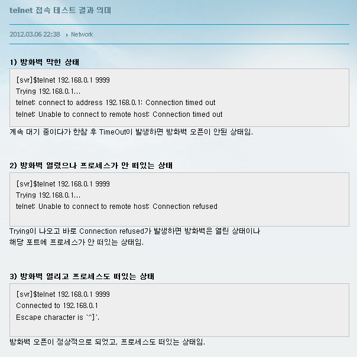

# 1. hacking shortcuts
- verify HTTP / SYN
```
netstat -an | grep :80 | sort
```
- verify all TCP / UDP connections

```
netstat -ntu | grep ESTAB | awk '{print $5}' | cut -d: -f1 | sort | uniq -c | sort -nr
```

- Bans IP's

```
iptables -I INPUT -s <ipaddress> -j DROP     //ban
iptables -D INPUT -s <ipaddress> -j DROP     //unban
```

old

```
iptables -A INPUT 1 -s <ipaddress> -j DROP/REJECT
```

- view banned IPs
```
iptables -L INPUT -v -n
```

- KILL && Restart connection

```
killall -KILL httpd

service httpd start     // for Red Hat systems
/etc/init/d/apache2 restrat // for Debian systems
```

# 2. Telnet 의미



# 3. Address already in use
사용중인 포트번호 검색
```
netstat -lntp
```
돌리고잇는 해당 process 죽이기 
```
kill -9 8533
```
포트는 차지해있는데, process 가 없을 수도 있음.
ex) Mysql