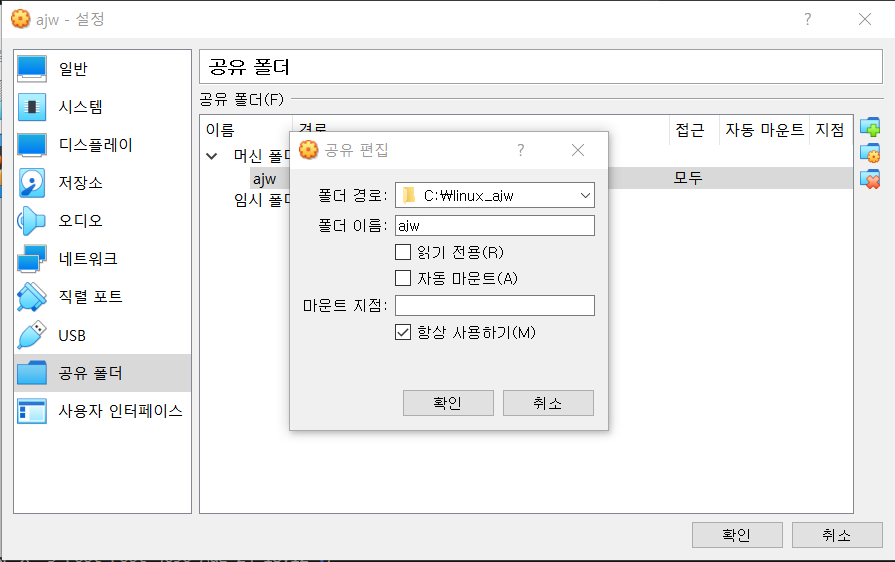
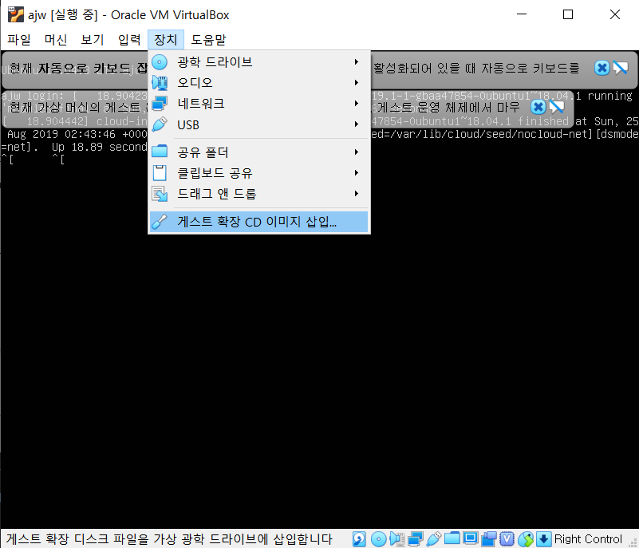
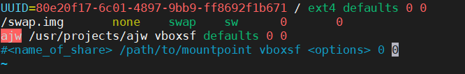

우분투 노트
=================

목차

- [1. 공유 폴더 마운트](#1-공유-폴더-마운트)
- [2. SSH 연결](#)

# 1. 공유 폴더 마운트

## 1.1. VM VirtualBox 설정

Step 1. 공유 폴더 생성

- 자동 마운트 -> X 
    - /media/sf_share 등의 원하지 않는 경로에 마운트를 실행한다
- 항상 사용하기 -> O
    - VM 재실행해도 공유 폴더 유지

Step 2. 우분투 실행 후 게스트 확장 CD 이미지 삽입


## 1.2. 우분투 명령어

Step 1. 게스트 확장 CD 이미지 실행을 위해 CDROM 마운트
```bash
cd /media
sudo mkdir cdrom
sudo mount /dev/sr1 /media/cdrom
```
- `/dev/sr1` 실패시 `/dev/sr0` 시도해볼 것
- `/media/cdrom` 에 CD 파일들 확인

Step 2. 게스트 확장 CD 실행을 위한 패키지 install
```bash
sudo apt-get update
sudo apt-get install build-essential linux-headers-$(uname -r)
```

Step 3. 경로에 마운트 된 게스트 확창 CD 실행
```bash
cd /media/cdrom
sudo ./VBoxLinuxAdditions.run 
```

Step 4. 재부팅
```bash
sudo shutdown -r now
```

Step 5. 마운트 하고자 하는 디렉토리 생성
```bash
sudo mkdir -p /usr/projects/ajw
cd /usr/projects
sudo chown ajw:ajw ajw
```
- `/ajw` 폴더의 소유자 및 그룹을 ajw으로 변경한다

Step 6. `mount` 명령어를 통한 마운트 실행
```bash
sudo mount -t vboxsf ajw /usr/projects/ajw
```
- -t 옵션은 마운트할 type을 vboxsf 로 지정
- ajw 는 VirtualBox에서 생성한 폴더 이름
- 마지막은 ubuntu 내부 경로

Step 7. 우분투 재 실행시 자동 마운트 설정
```bash
sudo vi /etc/fstab

한줄 추가 후 저장

ajw /usr/projects/ajw vboxsf defaults 0 0
```
